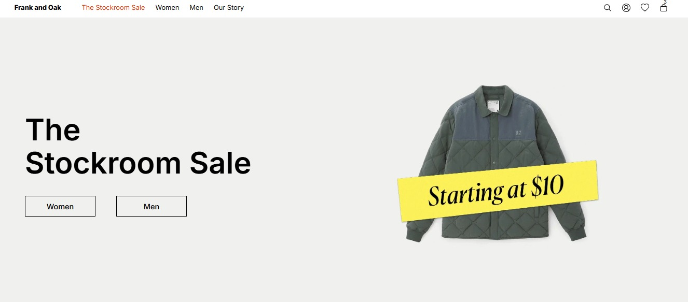
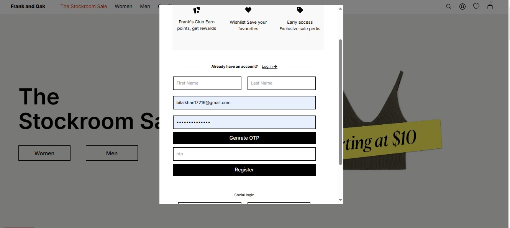
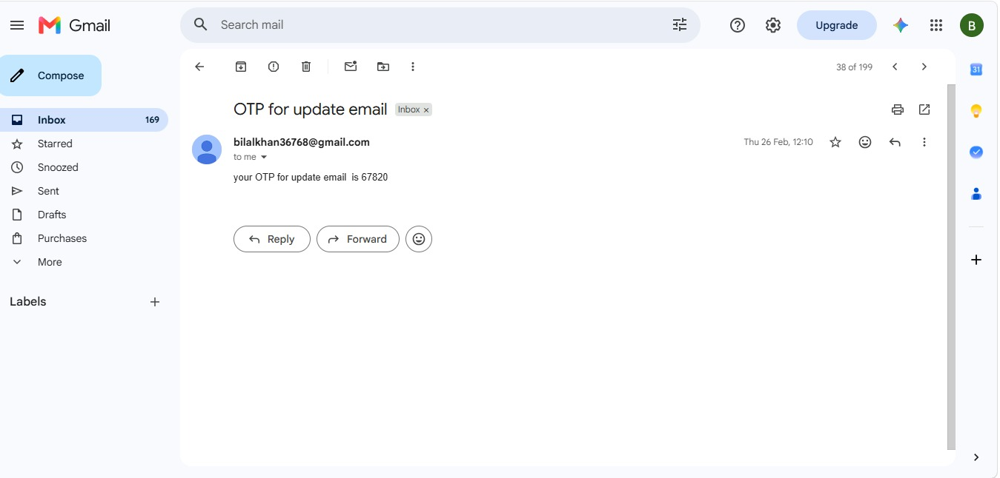

<div align="center">

# 🛍️ Frank & Oak MERN E-Commerce Platform

### Modern Full Stack E-Commerce Web Application

<p align="center">


</p>

<p>

A modern **Full Stack MERN E-Commerce Application** inspired by **Frank & Oak**, built with **Next.js**, featuring secure authentication, OTP verification, Stripe payment integration, Admin Dashboard, and complete CRUD functionality.

</p>

</div>

---

# 📑 Table of Contents

- 📌 Overview
- ✨ Features
- 🛠️ Tech Stack
- 📸 Screenshots
- 📂 Folder Structure
- ⚙️ Installation
- 🔑 Environment Variables
- ▶️ Running the Project
- 🚀 Future Improvements
- 👨‍💻 Author

---

# 📌 Overview

Frank & Oak Clone is a modern Full Stack E-Commerce application developed using the MERN Stack with Next.js. The application provides a complete online shopping experience, allowing users to register, verify their email using OTP, securely log in, browse products, add items to the cart, complete purchases through Stripe, and manage their accounts.

The Admin Dashboard enables administrators to perform complete CRUD operations on products, manage users, process orders, and efficiently control the entire store from a single interface.

---

# ✨ Features

<table>
<tr>

<td valign="top" width="50%">

## 🔐 Authentication & Security

- 👤 User Registration
- 🔑 Secure Login
- 🛡️ JWT Authentication
- 📧 OTP Email Verification
- 🔄 Forgot Password
- 🚪 Protected Routes
- 🔒 Password Encryption
- 🍪 Secure Session Management

</td>

<td valign="top" width="50%">

## 🛒 Shopping Experience

- 🏠 Home Page
- 📦 Product Listing
- 🔍 Product Details
- 🗂️ Product Categories
- 🔎 Advanced Product Search
- ❤️ Wishlist
- 🛍️ Shopping Cart
- 💳 Stripe Payment Integration
- 📋 Order Placement
- 📦 Order History

</td>

</tr>

<tr>

<td valign="top">

## 👨‍💼 Admin Dashboard

- 📊 Dashboard
- ➕ Add Products
- ✏️ Edit Products
- 🗑️ Delete Products
- 👥 Manage Users
- 📦 Manage Orders
- 🔄 Complete CRUD Operations
- 📈 Inventory Management

</td>

<td valign="top">

## 🚀 Performance

- ⚡ Built with Next.js
- ⚛️ React.js Frontend
- 🟢 Node.js Backend
- 🚂 Express.js REST APIs
- 🍃 MongoDB Database
- 📱 Responsive Design
- 🎨 Modern UI
- ♻️ Reusable Components
- 🚀 Optimized Performance

</td>

</tr>

</table>

---

# 🛠️ Tech Stack

<p align="center">


</p>

<p align="center">


</p>

---

# 📸 Screenshots

> Create a **screenshots** folder in the project root and add your project images using the filenames below.

## 🏠 Home Page

<p align="center">
  
</p>

\

---

## 🛒 Shopping Cart

<p align="center">
  
</p>

---


---

## 💳 Checkout

<p align="center">
  
</p>

---

## 🔐 Login Page

<p align="center">
  
</p>

---

## 👤 Register Page

<p align="center">
  
</p>

---

## 📧 OTP Verification

<p align="center">
  
</p>

---

## 👨‍💼 Admin Dashboard

<p align="center">
  
</p>

---


---

# 📂 Project Structure

```text
Frank-And-Oak/
│
├── frontend/
│   ├── src/
│   ├── public/
│   ├── package.json
│   └── ...
│
├── backend/
│   ├── config/
│   ├── controllers/
│   ├── middleware/
│   ├── models/
│   ├── routes/
│   ├── uploads/
│   ├── utils/
│   ├── server.js
│   └── package.json
│
├── admin/
│   ├── src/
│   ├── public/
│   ├── package.json
│   └── ...
│
├── screenshots/
│   ├── home.png
│   ├── product-details.png
│   ├── cart.png
│   ├── wishlist.png
│   ├── checkout.png
│   ├── login.png
│   ├── register.png
│   ├── otp.png
│   ├── admin-dashboard.png
│   └── product-management.png
│
├── README.md
└── .gitignore
```

---

# ⚙️ Installation

## 1️⃣ Clone the Repository

```bash
git clone https://github.com/kWD36768/my-MERN-Stack-project.git
```

---

## 2️⃣ Navigate to the Project Folder

```bash
cd Frank-And-Oak
```

---

## 3️⃣ Install Backend Dependencies

```bash
cd backend
npm install
```

---

## 4️⃣ Install Frontend Dependencies

```bash
cd ../frontend
npm install
```

---

## 5️⃣ Install Admin Panel Dependencies

```bash
cd ../admin
npm install
```

---

# 🔑 Environment Variables

Create a **.env** file inside the backend folder.

```env
PORT=5000

MONGO_URI=your_mongodb_connection

JWT_SECRET=your_jwt_secret

EMAIL=your_email@gmail.com

EMAIL_PASSWORD=your_email_password

STRIPE_SECRET_KEY=your_stripe_secret_key

NEXT_PUBLIC_STRIPE_PUBLISHABLE_KEY=your_publishable_key
```

---

# ▶️ Running the Project

### Start Backend

```bash
cd backend
npm start
```

---

### Start Frontend

```bash
cd frontend
npm run dev
```

---

### Start Admin Panel

```bash
cd admin
npm run dev
```

---

Open your browser:

```text
Frontend : http://localhost:3000

Backend : http://localhost:5000

Admin : http://localhost:3001
```

---

# 📂 Create Screenshots Folder

Run this command in your project root.

```bash
mkdir screenshots
```

Then place all screenshots inside the folder.

Example:

```
screenshots/
│── home.png
│── product-details.png
│── cart.png
│── wishlist.png
│── checkout.png
│── login.png
│── register.png
│── otp.png
│── admin-dashboard.png
└── product-management.png
```

---# 🚀 Deployment

The application can be deployed using the following platforms:

| Service | Platform |
|---------|----------|
| 🌐 Frontend | Vercel |
| ⚙️ Backend API | Render |
| 🗄️ Database | MongoDB Atlas |
| 👨‍💼 Admin Panel | Vercel |

---

# 📡 REST API Features

- 🔐 JWT Authentication
- 📧 OTP Email Verification
- 👤 User Authentication APIs
- 📦 Product CRUD APIs
- 🛒 Cart Management APIs
- 💳 Stripe Payment APIs
- 👨‍💼 Admin APIs

---

# 📈 Project Highlights

✔️ Full Stack MERN Architecture

✔️ Next.js Frontend

✔️ React.js Admin Dashboard

✔️ Node.js & Express.js Backend

✔️ MongoDB Database

✔️ JWT Authentication

✔️ OTP Email Verification

✔️ Stripe Payment Integration

✔️ Complete CRUD Operations

✔️ Secure Backend

✔️ Clean Folder Structure

✔️ Optimized Performance

---

# 🎯 Future Improvements

- 🤖 AI Product Recommendations
- 🌙 Dark Mode
- 🌍 Multi-language Support
- 🔔 Push Notifications
- 📊 Sales Analytics Dashboard
- 💬 Live Chat Support
- 📱 Progressive Web App (PWA)
- ⭐ Product Reviews & Ratings
- 🎁 Discount Coupons
- 📦 Real-Time Order Tracking

---

# 🤝 Contributing

Contributions, issues, and feature requests are welcome.

If you'd like to improve this project:

1. Fork the repository.
2. Create your feature branch.
3. Commit your changes.
4. Push to your branch.
5. Open a Pull Request.

---

# ⭐ Show Your Support

If you found this project useful, please consider giving it a **⭐ Star** on GitHub.

It helps others discover the project and motivates future improvements.

---

# 👨‍💻 Author

<div align="center">

## Bilal Khan

### MERN Stack Developer

💻 Passionate about building modern, scalable, and responsive Full Stack web applications using the MERN Stack.

<p align="center">

<a href="www.linkedin.com/in/muhammad-bilal-a00aa7336">

</a>

<a href="https://github.com/kWD36768">

</a>

<a href="mailto:bilalkhan17216@gmail.com">

</a>

</p>

</div>

---

# 📄 License

This project is licensed under the **MIT License**.

You are free to use, modify, and distribute this project for learning and educational purposes.

---

# 🙏 Acknowledgements

Special thanks to the open-source community and the amazing technologies that made this project possible.

- ⚛️ React.js
- ▲ Next.js
- 🟢 Node.js
- 🚂 Express.js
- 🍃 MongoDB
- 💳 Stripe
- 🔐 JWT
- 📧 Nodemailer
- 🐙 Git & GitHub

---

<div align="center">

# ❤️ Thank You for Visiting

### If you like this project, don't forget to leave a ⭐ on GitHub!


### 🚀 Happy Coding!

</div>