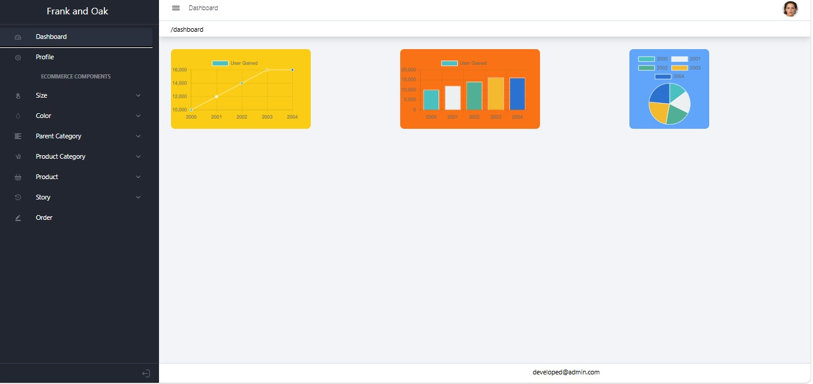
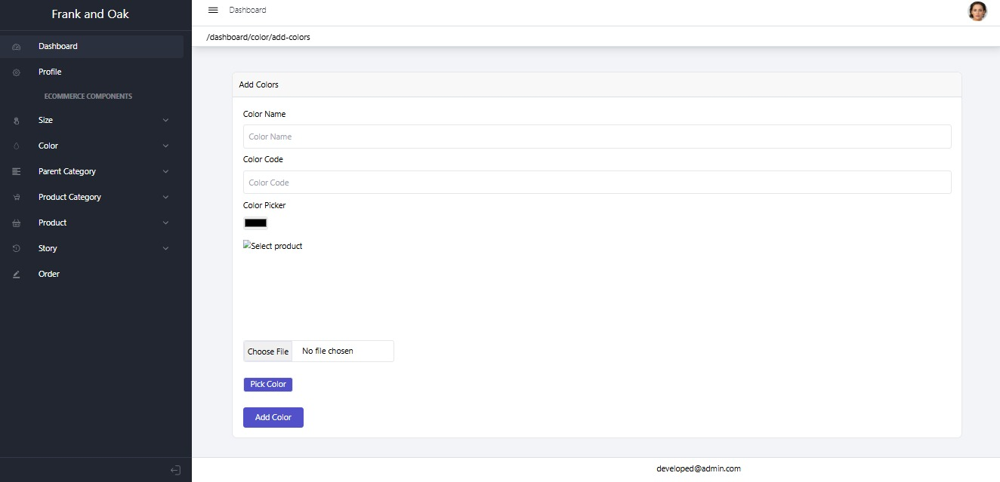
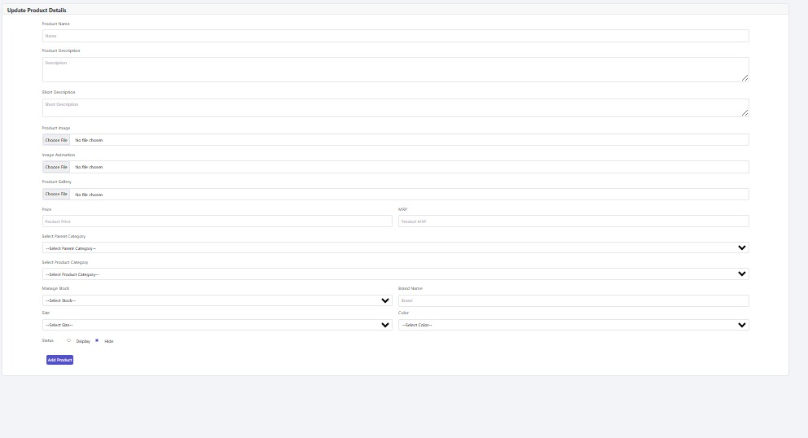
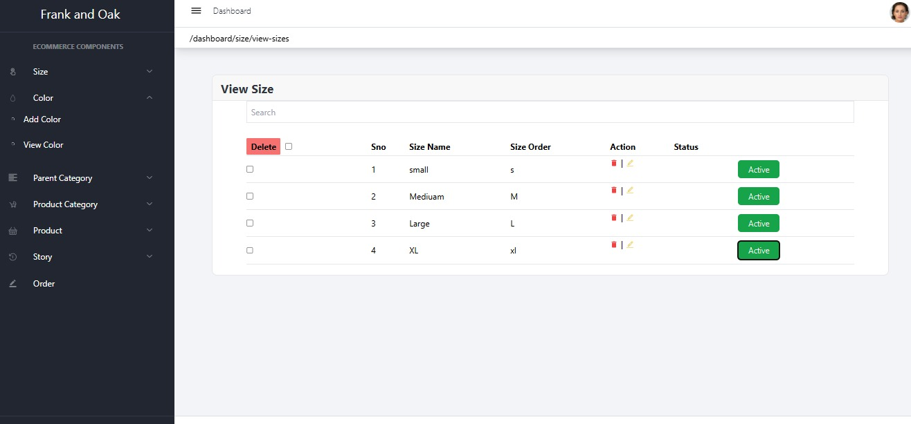
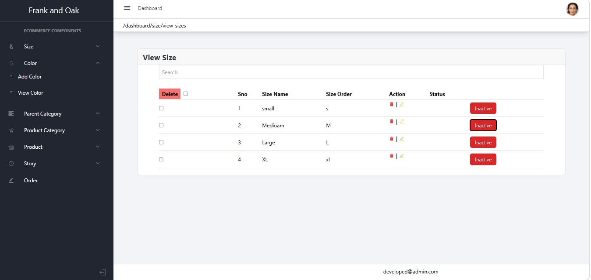
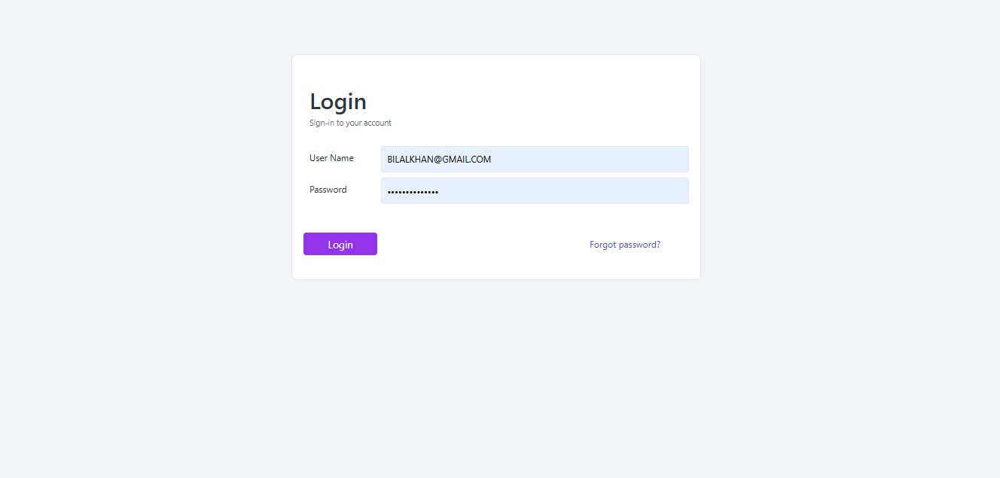

<div align="center">


# 👨‍💼 Frank & Oak Admin Panel

### React.js Based Admin Dashboard for MERN E-Commerce

<p align="center">


</p>

<p align="center">


</p>

<p align="center">

<a href="../README.md">

</a>

<a href="../frank-and-oak-website/README.md">

</a>

<a href="../server/README.md">

</a>

</p>

</div>

---

# 📑 Table of Contents

- 📌 Overview
- ✨ Features
- 🛠️ Tech Stack
- 📂 Folder Structure
- 📸 Screenshots
- ⚙️ Installation
- 📦 Required Packages
- 🌐 Environment Variables
- ▶️ Run Project
- 📜 Available Scripts
- 👨‍💻 Author

---

# 📌 Overview

The **Frank & Oak Admin Panel** is a React.js-based dashboard developed to manage the complete MERN E-Commerce application.

It allows administrators to manage products, users, customer orders, product status (Active/Inactive), categories, and other store operations through a clean and responsive interface connected to the Express.js REST API.

---

# ✨ Features

<table>

<tr>

<td valign="top" width="50%">

## 📦 Product Management

- ➕ Add Products
- ✏️ Edit Products
- 🗑️ Delete Products
- 👀 View Products
- 🔄 Update Product Details
- 🟢 Active Status
- 🔴 Inactive Status
- 🖼️ Upload Product Images
- 🔍 Search Products

</td>


</tr>

<tr>


<td valign="top">

## ⚡ Dashboard Features

- 📊 Admin Dashboard
- 📦 Product Overview
- 
- 🌐 REST API Integration
- 🔒 Secure Admin Access

</td>

</tr>

</table>

---

# 🛠️ Tech Stack

| 🛠️ Technology | 📌 Purpose |
|---------------|------------|
| ⚛️ React.js | Frontend Library |
| 🟨 JavaScript | Programming Language |
| 🎨 CSS3 | Styling |
| 🌐 HTML5 | Markup |
| 🔗 Axios | API Communication |
| 🎯 React Icons | Icons |
| 🟢 Node.js | Backend Runtime |
| 🚂 Express.js | REST APIs |
| 🍃 MongoDB | Database |
| 🐙 Git | Version Control |
| 📂 GitHub | Source Code Hosting |
| 💻 VS Code | Development Environment |

---
# 📂 Folder Structure

```text
admin/
│
├── public/
│
├── src/
│   ├── assets/
│   ├── components/
│   ├── pages/
│   ├── layouts/
│   ├── context/
│   ├── services/
│   ├── hooks/
│   ├── utils/
│   └── styles/
│
├── package.json
├── README.md
└── .gitignore
```

---

# 📸 Admin Panel Screenshots

> Create a **screenshots** folder inside the **admin** directory and place your images using the following names.

## 📊 Dashboard

<p align="center">

</p>

---

## 📦 Product List

<p align="center">

</p>

---

## ➕ Add Color

<p align="center">

</p>

---

## ✏️ Edit Product

<p align="center">

</p>

---

## 🟢 Active Sizes

<p align="center">

</p>

---

## 🔴 Inactive Sizes

<p align="center">

</p>


---


## 🔐 Admin Login

<p align="center">

</p>

---

# ⚙️ Installation

### 📥 Clone Repository

```bash
git clone YOUR_GITHUB_REPOSITORY_LINK
```

---

### 📂 Navigate to Admin Panel

```bash
cd admin
```

---

### 📦 Install Dependencies

```bash
npm install
```

---

# 📦 Required Packages

- ⚛️ React.js
- 🌐 Axios
- 🎯 React Icons
- 📊 Chart.js (if used)
- 🔔 React Toastify
- 📋 React Router DOM
- 📦 SweetAlert2 (if used)

---

# 🌐 Environment Variables

Create a **.env** file inside the **admin** folder.

```env
REACT_APP_API_URL=http://localhost:5000
```

> If your project doesn't use an `.env` file for the admin panel, you can remove this section.

---

# ▶️ Running the Admin Panel

### Development Mode

```bash
npm start
```

---

### Create Production Build

```bash
npm run build
```

---

# 🌍 Default URLs

### Admin Panel

```text
http://localhost:3001
```

### Backend API

```text
http://localhost:5000
```

---

# 🔗 Connected Services

- 🟢 Express.js REST API
- 🍃 MongoDB Database
- 🔐 JWT Authentication
- 📧 OTP Authentication
- 📦 Product APIs
- 👥 User APIs

---
# 📊 Dashboard Modules

The Admin Dashboard provides a centralized interface to manage the complete E-Commerce platform.

| 📌 Module | 📝 Description |
|-----------|----------------|
| 📊 Dashboard | View overall store statistics |
| 📦 Products | Manage all products |
| ➕ Add Product | Add new products |
| ✏️ Edit Product | Update existing products |
| 🗑️ Delete Product | Remove products |
| 🟢 Active Products | Display active products |
| 🔴 Inactive Products | Display inactive products |
| 📋 Orders | Manage customer orders |
| 👥 Users | View registered users |

---

# 📦 Product Management Workflow

```text
Admin Login
      │
      ▼
 Dashboard
      │
      ▼
 Products
      │
      ├─────────────► ➕ Add Product
      │
      ├─────────────► ✏️ Edit Product
      │
      ├─────────────► 🗑 Delete Product
      │
      ├─────────────► 🟢 Active Status
      │
      └─────────────► 🔴 Inactive Status
```

---

# 🟢 Active / 🔴 Inactive Product Status

The Admin Panel allows administrators to control product visibility without permanently deleting products.

### 🟢 Active

- ✅ Product is visible on the frontend.
- 🛒 Customers can purchase the product.
- 🔍 Product appears in search results.

### 🔴 Inactive

- 📂 Preserved in the database.
- 🔄 Can be reactivated at any time.

---


### Available Actions

- 👤 View Users
- 📧 View User Details
- ✏️ Update User Information
- 

---

# 🔐 Security Features

- 🔑 Secure Admin Login
- 🛡️ JWT Authentication
- 🚪 Protected Admin Routes
- 🔒 Secure REST APIs
- 🌐 Role-Based Access Control
- ⚠️ Unauthorized Access Prevention

---

# 📡 API Integration

The Admin Panel communicates with the backend using REST APIs.

### Connected Modules

- 👤 Authentication API
- 📦 Product API
- 📂 Category API
- 📋 Order API
- 👥 User API
- 🟢 Product Status API
- 🔴 Product Visibility API

---

# ⚡ Performance Features

- ⚛️ React Component Architecture
- ♻️ Reusable Components
- 📦 Optimized API Requests
- 🚀 Fast Dashboard Rendering
- 📂 Organized Folder Structure
- 🎨 Clean User Interface

---

# 🎯 Best Practices

- 📁 Clean Project Structure
- ♻️ Reusable Components
- 📦 Modular Codebase
- 🚀 Optimized Performance
- 📱 Responsive Design
- 🔐 Secure Authentication
- 📡 RESTful API Integration
- 🧹 Maintainable Code

---

# 🚀 Future Improvements

- 📊 Advanced Analytics Dashboard
- 📈 Sales Reports
- 📦 Inventory Analytics
- 📧 Email Notifications
- 🔔 Push Notifications
- 🌙 Dark Mode
- 🌍 Multi-language Support
- 🤖 AI Sales Insights
- 📱 Progressive Web App (PWA)

---

# 🤝 Contributing

Contributions are always welcome.

1. 🍴 Fork the repository.
2. 🌿 Create a feature branch.
3. 💻 Implement your changes.
4. ✅ Commit your work.
5. 🚀 Push to GitHub.
6. 📩 Open a Pull Request.

---

# ⭐ Support

If you found this Admin Panel useful,

please consider giving the repository a **⭐ Star** on GitHub.

Your support encourages continued improvements.

---
# 🏆 Project Highlights

✔️ Modern React.js Admin Dashboard

✔️ Complete Product CRUD Operations

✔️ Active / Inactive Product Management

✔️ Customer Order Management

✔️ Registered User Management

✔️ Secure JWT Authentication

✔️ REST API Integration

✔️ Responsive Dashboard

✔️ Clean & Modular Code

✔️ Production Ready Architecture

---

# 📊 Project Statistics

| 📌 Information | 📈 Details |
|---------------|------------|
| ⚛️ Framework | React.js |
| 🟨 Language | JavaScript (ES6+) |
| 🌐 API | REST API |
| 🍃 Database | MongoDB |
| 🔐 Authentication | JWT |
| 📦 CRUD | Complete CRUD |
| 📱 Responsive | Yes |
| 🖥️ Dashboard | Admin Panel |
| 📂 Version Control | Git & GitHub |

---

# 📚 Learning Outcomes

This project demonstrates practical experience with:

- ⚛️ React.js Development
- 📦 CRUD Operations
- 🌐 REST API Integration
- 🔗 Axios Requests
- 🔐 JWT Authentication
- 👥 User Management
- 📋 Order Management
- 📦 Product Management
- 🟢 Active / 🔴 Inactive Status Control
- 📁 Scalable Project Structure
- ♻️ Component Reusability

---

# 🤝 Connect With Me

<div align="center">

<a href="YOUR_GITHUB_PROFILE">

</a>

<a href="YOUR_LINKEDIN_PROFILE">

</a>

<a href="mailto:YOUR_EMAIL@gmail.com">

</a>

</div>

---

# 👨‍💻 Author

<div align="center">

## Bilal Khan

### MERN Stack Developer

💻 Passionate about building modern, scalable, and responsive Full Stack Web Applications using the MERN Stack ecosystem.

<p align="center">


</p>

</div>

---

# 📝 Available Scripts

### ▶️ Start Development Server

```bash
npm start
```

---

### 📦 Install Dependencies

```bash
npm install
```

---

### 🏗️ Create Production Build

```bash
npm run build
```

---

# 📄 License

This project is licensed under the **MIT License**.

You are free to use, modify, and distribute this project for learning and educational purposes.

---

# 🙏 Acknowledgements

Special thanks to the amazing open-source technologies used in this project.

- ⚛️ React.js
- 🟢 Node.js
- 🚂 Express.js
- 🍃 MongoDB
- 🔐 JWT
- 🌐 REST APIs
- 🐙 Git & GitHub

---

# ⭐ Show Your Support

If you found this project helpful,

please consider giving it a **⭐ Star** on GitHub.

Your support motivates future improvements and open-source contributions.

---

<div align="center">

# ❤️ Thank You for Visiting

### 🚀 Happy Coding!


</div>