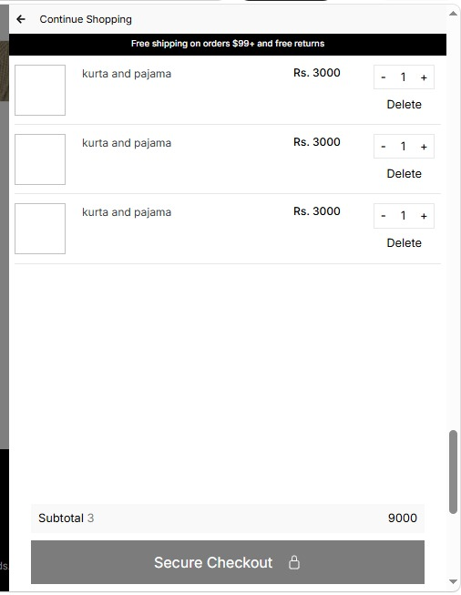
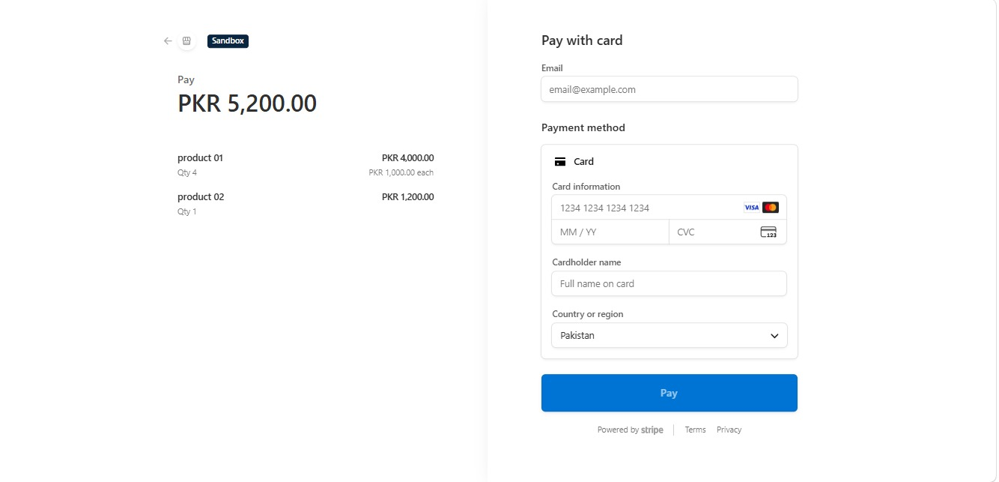

<div align="center">


# 🛍️ Frank & Oak Frontend

### Modern Next.js E-Commerce Frontend

<p align="center">


</p>

<p align="center">


</p>

<p align="center">

<a href="../README.md">

</a>

<a href="../server/README.md">

</a>

<a href="../admin/README.md">

</a>

</p>

</div>

---

# 📑 Table of Contents

- 📌 Overview
- ✨ Features
- 🛠️ Tech Stack
- 📂 Folder Structure
- 📸 Screenshots
- ⚙️ Installation
- 🌐 Environment Variables
- ▶️ Run Project
- 📄 Pages
- 👨‍💻 Author

---

# 📌 Overview

The **Frank & Oak Frontend** is built with **Next.js** and provides a fast, responsive, and modern shopping experience.

It communicates with the **Node.js + Express Backend API** and allows users to browse products, authenticate securely, manage their shopping cart, and complete payments using Stripe.

---

# ✨ Frontend Features

<table>

<tr>

<td valign="top" width="50%">

## 🏠 User Experience

- 🏠 Beautiful Home Page
- 📦 Product Listing
- 🔍 Product Details
- 🗂️ Product Categories
- 🛍️ Shopping Cart
- 💳 Secure Checkout


</td>

<td valign="top" width="50%">

## 🔐 Authentication

- 👤 User Registration
- 🔑 Secure Login
- 📧 OTP Verification
- 🔄 Forgot Password
- 🛡️ JWT Authentication
- 🚪 Protected Routes
- 🍪 Session Management
- 🔒 Secure User Access
- 👤 User Profile
- ✏️ Profile Update

</td>

</tr>

<tr>

<td valign="top">

## ⚡ Performance

- ⚡ Next.js App Router
- 🚀 Fast Loading
- 🎨 Modern UI
- ♻️ Reusable Components
- 🌐 REST API Integration
- 📦 Optimized Images
- 🔄 Dynamic Routing
-
</td>

<td valign="top">

## 💳 Shopping

- 🛒 Add to Cart
- ➖ Remove Items
- ➕ Update Quantity
- 💰 Stripe Checkout
- 📦 Place Orders
- 📋 Order Summary
- 💵 Secure Payments
- 📄 Order Confirmation

</td>

</tr>

</table>

---

# 🛠️ Tech Stack

| Technology | Purpose |
|------------|---------|
| ⚛️ Next.js | Frontend Framework |
| ⚛️ React.js | UI Library |
| 🟨 JavaScript | Programming Language |
| 🎨 CSS3 | Styling |
| 🌐 HTML5 | Markup |
| 💨 Tailwind CSS | Responsive UI |
| 🔗 Axios | API Calls |
| 🎯 React Icons | Icons |
| 🐙 Git | Version Control |
| 📂 GitHub | Repository Hosting |
| 💻 VS Code | Development Environment |

---
# 📂 Folder Structure

```text
frank-and-oak-website/
│
├── public/
│
├── src/
│   ├── app/
│   ├── components/
│   ├── context/
│   ├── hooks/
│   ├── services/
│   ├── styles/
│   ├── utils/
│   └── assets/
│
├── package.json
├── next.config.mjs
├── eslint.config.mjs
└── README.md
```

---

# 📸 Frontend Screenshots

> Save all screenshots inside the **screenshots** folder.

## 🏠 Home Page

<p align="center">

</p>

---


## 🛒 Shopping Cart

<p align="center">

</p>

---

## 💳 Stripe

<p align="center">

</p>

---

## 👤 Login

<p align="center">

</p>

---

## 📝 Register

<p align="center">

</p>

---

## 📧 OTP Verification

<p align="center">

</p>

---

# ⚙️ Installation

### 📥 Clone Repository

```bash
git clone YOUR_REPOSITORY_LINK
```

---

### 📂 Navigate to Frontend

```bash
cd frank-and-oak-website
```

---

### 📦 Install Dependencies

```bash
npm install
```

---

# 📦 Required Packages

- ⚛️ Next.js
- ⚛️ React.js
- 🌐 Axios
- 🎨 Tailwind CSS
- 🔔 React Toastify
- 💳 Stripe
- 🎯 React Icons
- 🍪 js-cookie
- 🔄 Swiper.js

---


---

# ▶️ Running the Frontend

Development Mode

```bash
npm run dev
```

Production Build

```bash
npm run build
```

Run Production

```bash
npm start
```

---

# 🌍 Default URLs

```text
Frontend

http://localhost:3000
```

Backend API

```text
http://localhost:5000
```

---

---

# 🔗 Connected Services

- 🟢 Express.js Backend API
- 🍃 MongoDB Database
- 💳 Stripe Payment Gateway
- 📧 Nodemailer OTP Service
- 🔐 JWT Authentication

---
# 📄 Application Pages

| 🖥️ Page | 📋 Description |
|----------|----------------|
| 🏠 Home | Landing page with featured collections and latest products. |
| 🛍️ Shop | Browse all available products. |
| 📦 Product Details | View complete product information. |
| 🔍 Search | Search products instantly. |
| ❤️ Wishlist | Save favorite products. |
| 🛒 Cart | Manage shopping cart items. |
| 💳 Checkout | Complete secure payment using Stripe. |
| 👤 Login | Secure user authentication. |
| 📝 Register | Create a new user account. |
| 📧 OTP Verification | Verify email address using OTP. |
| 👤 Profile | Manage user profile information. |
| 📋 Orders | View previous orders. |
| ❌ 404 Page | Custom page for invalid routes. |

---

# 🧩 Reusable Components

## 🎨 UI Components

- 🎯 Navbar
- 🦶 Footer
- 🏷️ Product Card
- 📦 Product Grid
- 🖼️ Image Gallery
- ⭐ Rating Component
- 🔎 Search Bar
- 🎠 Hero Banner
- 🎞️ Carousel / Slider
- 🔘 Buttons
- 📋 Modal
- ⏳ Loader
- 🚫 Empty State
- ⚠️ Error Page

---

## ⚛️ React Features

- ⚡ Functional Components
- 🎣 Custom Hooks
- 🔄 Context API
- 🧩 Reusable Components
- 🚀 Lazy Loading
- 🌐 API Integration
- 📱 Responsive Layout
- ♻️ Component-Based Architecture

---

# 🚀 Performance Features

- ⚡ Fast Navigation
- 📦 Optimized Images
- 🗂️ Clean Folder Structure
- 🔄 Dynamic Routing
- 🚀 Optimized Rendering
- 🔥 High Performance

---

# 🔐 Security Features

- 🔑 JWT Authentication
- 📧 OTP Email Verification
- 🚪 Protected Routes
- 🔒 Secure API Requests
- 🍪 Cookie-Based Authentication
- 🛡️ Input Validation
- 🚫 Unauthorized Access Protection

---

# 📡 API Integration

The frontend communicates with the backend using REST APIs.

### 🔗 Connected Modules

- 👤 Authentication APIs
- 📦 Products APIs
- ❤️ Wishlist APIs
- 🛒 Cart APIs
- 💳 Stripe Payment APIs
- 📋 Orders APIs
- 👤 Profile APIs

---

# 📦 NPM Scripts

### ▶️ Development

```bash
npm run dev
```

### 🏗️ Build Project

```bash
npm run build
```

### 🚀 Start Production

```bash
npm start
```

### 🔍 Lint Project

```bash
npm run lint
```

---

# 🎯 Best Practices

- 📁 Organized Folder Structure
- ♻️ Reusable Components
- 🧹 Clean Code
- ⚡ Optimized Performance
- 🔒 Secure Authentication
- 📦 Modular Architecture
- 🌐 API Driven Development

---

# 🚀 Future Improvements

- 🌙 Dark Mode
- 🌍 Multi-language Support
- 🤖 AI Product Recommendations
- 🔔 Push Notifications
- ⭐ Product Reviews
- 💬 Live Chat
- 📊 Analytics Dashboard
- 📦 Order Tracking
- 🎁 Discount Coupons
- 📱 Progressive Web App (PWA)

---

# 🤝 Contributing

Contributions are welcome!

1. 🍴 Fork the repository.
2. 🌿 Create a new branch.
3. 💻 Make your changes.
4. ✅ Commit your code.
5. 🚀 Push to GitHub.
6. 📩 Open a Pull Request.

---

# 💙 Support

If you found this project helpful,

⭐ Don't forget to **Star** the repository.

Your support motivates future improvements.

---

# 📊 Project Statistics

| 📌 Information | 📈 Details |
|---------------|------------|
| ⚛️ Framework | Next.js 15 |
| 🎨 UI Library | React.js |
| 🟨 Language | JavaScript |
| 🌐 API | REST API |
| 💳 Payment | Stripe |
| 🔐 Authentication | JWT + OTP |
| 🍃 Database | MongoDB |
| 📱 Responsive | Yes |
| 🌙 Dark Mode | Planned |
| 🚀 Deployment | Vercel |

---

# 🏆 Highlights

✔️ Professional E-Commerce UI

✔️ Modern Next.js Architecture

✔️ REST API Integration

✔️ Stripe Payment Gateway

✔️ JWT Authentication

✔️ OTP Verification

✔️ Mobile Responsive

✔️ SEO Friendly

✔️ Clean Code Structure

✔️ Reusable Components

✔️ Optimized Performance

✔️ Production Ready

---

# 🤝 Connect With Me

<div align="center">

<a href="YOUR_GITHUB_LINK">

</a>

<a href="YOUR_LINKEDIN_LINK">

</a>

<a href="mailto:YOUR_EMAIL">

</a>

</div>

---

# 👨‍💻 Author

<div align="center">


## Bilal Khan

### MERN Stack Developer

💻 Passionate about building modern, scalable and production-ready Full Stack Web Applications.

### 💼 Tech Expertise

<p align="center">


</p>

</div>

---

# 📈 GitHub Stats

<div align="center">


</div>

---


---


---

# 👀 Visitor Counter

<div align="center">


</div>

---

# ⭐ Support

If you like this project,

Please consider giving it a ⭐ on GitHub.

It really helps and motivates me to build more open-source projects.

---

# 📜 License

This project is licensed under the **MIT License**.

Feel free to use it for learning, inspiration, and portfolio purposes.

---

<div align="center">

## ❤️ Thank You For Visiting

### 🚀 Happy Coding!


</div>