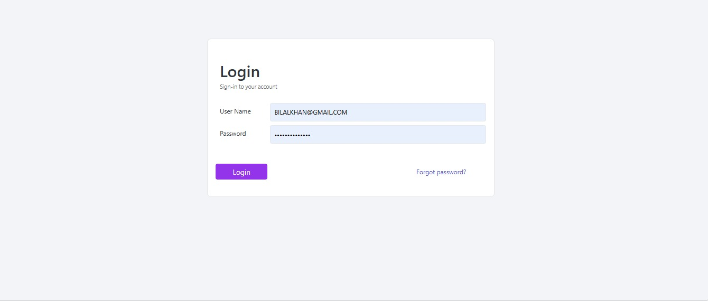
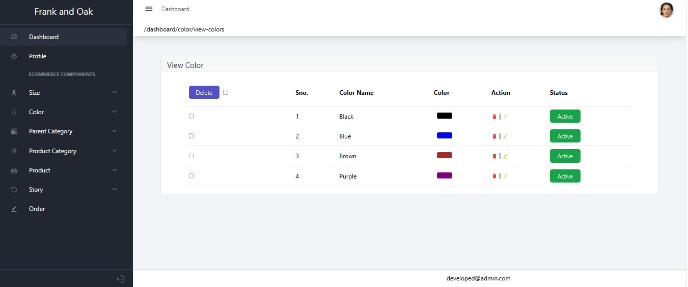

<div align="center">


# ⚙️ Frank & Oak Backend

### Node.js + Express.js REST API for MERN E-Commerce

<p align="center">


</p>

<p align="center">


</p>

<p align="center">

<a href="../README.md">

</a>

<a href="../frank-and-oak-website/README.md">

</a>

<a href="../admin/README.md">

</a>

</p>

</div>

---

# 📑 Table of Contents

- 📌 Overview
- ✨ Features
- 🛠️ Tech Stack
- 📂 Folder Structure
- 📸 Screenshots
- ⚙️ Installation
- 🌐 Environment Variables
- ▶️ Run Server
- 📡 API Modules
- 👨‍💻 Author

---

# 📌 Overview

The **Frank & Oak Backend** is built using **Node.js**, **Express.js**, and **MongoDB**, providing secure and scalable REST APIs for the MERN E-Commerce platform.

It handles authentication, OTP verification, JWT authorization, product management, order processing, Stripe payment integration, and complete CRUD operations while serving both the customer frontend and the admin dashboard.

---

# ✨ Backend Features

<table>

<tr>

<td valign="top" width="50%">

## 🔐 Authentication

- 👤 User Registration
- 🔑 Secure Login
- 🛡️ JWT Authentication
- 📧 OTP Email Verification
- 🔒 Password Hashing
- 🚪 Protected Routes
- 🍪 Secure Sessions

</td>

<td valign="top" width="50%">

## 📦 Product Management

- ➕ Add Products
- ✏️ Edit Products
- 🗑️ Delete Products
- 👀 View Products
- 📂 Product Categories
- 🟢 Active Products
- 🔴 Inactive Products

</td>

</tr>

<tr>

<td valign="top">

## 📋 Order Management


- 🔄 Update Order Status

- 💳 Stripe Payment

</td>

<td valign="top">

## ⚡ Backend Services

- 🌐 RESTful APIs
- 🍃 MongoDB Database
- 📧 Nodemailer Integration
- 🔒 Secure Middleware
- 📁 MVC Architecture
- 📤 Image Upload Support
- 🚀 High Performance
- 📱 API Ready

</td>

</tr>

</table>

---

# 🛠️ Tech Stack

| 🛠️ Technology | 📌 Purpose |
|---------------|------------|
| 🟢 Node.js | JavaScript Runtime |
| 🚂 Express.js | REST API Framework |
| 🍃 MongoDB | Database |
| 🔐 JWT | Authentication |
| 🔑 bcrypt | Password Hashing |
| 📧 Nodemailer | Email & OTP |
| 💳 Stripe | Payment Gateway |
| 📤 Multer | Image Upload |
| 🌐 CORS | Cross-Origin Requests |
| ⚙️ dotenv | Environment Variables |
| 🐙 Git | Version Control |
| 📂 GitHub | Repository Hosting |

---

# 📂 Project Structure

```text
server/
│
├── config/
├── controllers/
├── middleware/
├── models/
├── routes/
├── services/
├── utils/
├── uploads/
├── package.json
├── server.js
├── .env
└── README.md
```

> 📌 **Note:** If your folder names are different (for example `helpers`, `libs`, or `config/db.js`), simply update this section to match your actual project structure.

---

# 📸 Backend Screenshots

Create a **screenshots** folder inside the **server** directory and save your images using the following names.


## 🔑 Login API

<p align="center">

</p>

---

## 📧 OTP Verification

<p align="center">

</p>

---

## 📦 View Colors

<p align="center">

</p>

---


## 💳 Stripe Payment

<p align="center">

</p>

---

# ⚙️ Installation

### 📥 Clone the Repository

```bash
git clone YOUR_GITHUB_REPOSITORY_URL
```

---

### 📂 Navigate to Server

```bash
cd server
```

---

### 📦 Install Dependencies

```bash
npm install
```

---

# 📦 Required Packages

- 🟢 Express.js
- 🍃 Mongoose
- 🔐 JSON Web Token (JWT)
- 🔑 bcryptjs
- 📧 Nodemailer
- 💳 Stripe
- 📤 Multer
- 🌐 CORS
- ⚙️ dotenv
- 🔄 Nodemon (Development)
- 📝 Validator (if used)

---

# 🌐 Environment Variables

Create a `.env` file inside the **server** folder.

```env
PORT=5000

MONGODB_URI=YOUR_MONGODB_CONNECTION_STRING

JWT_SECRET=YOUR_SECRET_KEY

EMAIL_USER=YOUR_EMAIL

EMAIL_PASS=YOUR_EMAIL_PASSWORD

STRIPE_SECRET_KEY=YOUR_STRIPE_SECRET_KEY

CLIENT_URL=http://localhost:3000
```

> ⚠️ Never commit your `.env` file to GitHub.

---

# ▶️ Running the Server

### 🚀 Development Mode

```bash
npm run dev
```

---

### ▶️ Production Mode

```bash
npm start
```

---

# 🌍 Local Development URLs

### ⚙️ Backend API

```text
http://localhost:5000
```

### 🛍️ Frontend

```text
http://localhost:3000
```

### 👨‍💼 Admin Panel

```text
http://localhost:3001
```

---

# 📡 Connected Applications

- 🛍️ Next.js Frontend
- 👨‍💼 React Admin Panel
- 🍃 MongoDB Database
- 💳 Stripe Payment Gateway
- 📧 Nodemailer Email Service
- 🔐 JWT Authentication

---

# 📱 API Response Format

```json
{
  "success": true,
  "message": "Request completed successfully",
  "data": {}
}
```

---

# 🏗️ Backend Architecture

The backend follows the **MVC (Model-View-Controller)** architecture to keep the codebase clean, scalable, and maintainable.

```text
                Client Request
                      │
                      ▼
                 Express Routes
                      │
                      ▼
                 Controllers
                      │
          ┌───────────┴───────────┐
          ▼                       ▼
      Middleware              Services
          │                       │
          ▼                       ▼
        Models  ─────────────► MongoDB
```

---

# 🔐 Authentication Flow

```text
User Registration
        │
        ▼
Password Encryption (bcrypt)
        │
        ▼
Store User in MongoDB
        │
        ▼
Send OTP via Email
        │
        ▼
Verify OTP
        │
        ▼
Generate JWT Token
        │
        ▼
Access Protected Routes
```

---

# 📧 OTP Verification Flow

- 📩 User registers with email.
- 🔢 Server generates a One-Time Password (OTP).
- 📧 OTP is sent using Nodemailer.
- ⌛ OTP is validated before expiration.
- ✅ Email is verified successfully.

---

# 💳 Stripe Payment Flow

```text
Customer Checkout
        │
        ▼
Create Stripe Session
        │
        ▼
Redirect to Stripe Checkout
        │
        ▼
Payment Processing
        │
        ▼
Payment Successful
        │
        ▼
Create Order
        │
        ▼
Return Success Response
```

---

# 📦 CRUD Operations

The backend provides complete CRUD functionality for products.

### ➕ Create

- 📦 Add New Product
- 📸 Upload Product Image
- 📂 Assign Category

---

### 📖 Read

- 📋 Get All Products
- 🔍 Get Product Details
- 📂 Filter by Category
- 🔎 Search Products

---

### ✏️ Update

- ✏️ Update Product Information
- 🟢 Activate Product
- 🔴 Deactivate Product
- 📸 Update Product Image

---

### 🗑️ Delete

- ❌ Delete Product
- 🧹 Remove Product Assets
- 🔄 Update Product Collection

---

# 📡 API Modules

| 📦 Module | 📌 Description |
|-----------|----------------|
| 🔐 Authentication | Register, Login, JWT, OTP |
| 👤 Users | User Profile & Management |
| 📦 Products | Complete Product CRUD |
| 📂 Categories | Category Management |
| 🛒 Cart | Shopping Cart APIs |
| 📋 Orders | Order Management |
| 💳 Payments | Stripe Payment APIs |

---

# 🛡️ Middleware

The backend uses middleware for security and request processing.

- 🔑 JWT Verification
- 🔒 Authentication Middleware
- 🌐 CORS Configuration
- 📤 File Upload Middleware
- ⚙️ Error Handling
- 📜 Request Validation
- 📝 Request Logging

---

# ⚡ Performance Features

- 🚀 Optimized REST APIs
- 🍃 Efficient MongoDB Queries
- 📂 Modular Folder Structure
- 🔄 Async/Await Operations
- 📦 Clean Controller Logic
- 📱 Fast API Responses
- 🧹 Maintainable Codebase

---

# 🔒 Security Features

- 🔐 JWT Authentication
- 🔑 Password Hashing with bcrypt
- 📧 OTP Email Verification
- 🚫 Protected Routes
- 🌐 Secure API Communication
- ⚠️ Input Validation
- 🛡️ Error Handling
- 🔒 Environment Variables

---

# 🎯 Best Practices

- 📁 MVC Architecture
- ♻️ Modular Code
- 🧹 Clean Coding Standards
- 📦 Reusable Controllers
- 📂 Organized Routes
- 🔒 Secure Authentication
- 📡 RESTful API Design
- 🚀 High Performance

---

# 🚀 Future Enhancements

- 📊 Admin Analytics APIs
- ☁️ Cloud Image Storage

---

# 🤝 Contributing

Contributions are welcome!

1. 🍴 Fork the repository.
2. 🌿 Create a new branch.
3. 💻 Make your changes.
4. ✅ Commit your changes.
5. 🚀 Push to GitHub.
6. 📩 Create a Pull Request.

---

# ⭐ Support

If you like this project,

please consider giving it a **⭐ Star** on GitHub.

Your support helps improve future open-source projects.

---# 🏆 Project Highlights

✔️ Production-Ready REST API

✔️ Secure JWT Authentication

✔️ OTP Email Verification

✔️ Complete Product CRUD Operations

✔️ Category Management

✔️ Shopping Cart APIs

✔️ Wishlist APIs

✔️ Order Management System

✔️ Stripe Payment Gateway Integration

✔️ MongoDB Database Integration

✔️ MVC Architecture

✔️ Clean & Scalable Codebase

---

# 📊 Project Statistics

| 📌 Information | 📈 Details |
|---------------|------------|
| 🟢 Runtime | Node.js |
| 🚂 Framework | Express.js |
| 🍃 Database | MongoDB |
| 🔐 Authentication | JWT + OTP |
| 💳 Payment Gateway | Stripe |
| 📦 CRUD Operations | Complete |
| 📡 API Type | RESTful APIs |
| 🏗️ Architecture | MVC |
| 📂 Version Control | Git & GitHub |
| 📱 Frontend Support | Next.js + React Admin |

---

# 📚 Learning Outcomes

This backend project demonstrates practical experience with:

- 🟢 Node.js Backend Development
- 🚂 Express.js REST APIs
- 🍃 MongoDB & Mongoose
- 🔐 JWT Authentication
- 📧 OTP Email Verification
- 💳 Stripe Payment Integration
- 📦 Complete CRUD Operations
- 📋 Order Processing
- 👥 User Authentication & Authorization
- 📁 MVC Architecture
- 🌐 RESTful API Design
- 🔒 Secure Backend Development

---

# 📌 API Overview

| 🌐 Endpoint | 📋 Purpose |
|-------------|------------|
| 🔐 Authentication | Register, Login, Verify OTP, Forgot Password |
| 👤 Users | User Profile Management |
| 📦 Products | Complete Product CRUD |
| 📂 Categories | Category Management |
| ❤️ Wishlist | Wishlist Operations |
| 🛒 Cart | Shopping Cart Operations |
| 📋 Orders | Order Management |
| 💳 Payments | Stripe Checkout APIs |

---

# 🧪 Testing

The backend APIs have been tested using:

- 📬 Postman
- 🌐 Browser Requests
- 🧪 Manual API Testing

---

# 🤝 Connect With Me

<div align="center">

<a href="YOUR_GITHUB_PROFILE">

</a>

<a href="YOUR_LINKEDIN_PROFILE">

</a>

<a href="mailto:YOUR_EMAIL@gmail.com">

</a>

</div>

---

# 👨‍💻 Author

<div align="center">


## Bilal Khan

### MERN Stack Developer

💻 Passionate about building secure, scalable, and modern Full Stack Web Applications using the MERN Stack.

<p align="center">


</p>

</div>

---

# 📜 License

This project is licensed under the **MIT License**.

You are free to use, modify, and distribute this project for educational and portfolio purposes.

---

# 🙏 Acknowledgements

Special thanks to the amazing open-source technologies that made this project possible.

- 🟢 Node.js
- 🚂 Express.js
- 🍃 MongoDB
- 🔐 JSON Web Token (JWT)
- 📧 Nodemailer
- 💳 Stripe
- 🐙 Git & GitHub

---

# ⭐ Show Your Support

If this project helped you,

please consider giving the repository a **⭐ Star**.

Your support motivates future open-source development.

---

<div align="center">

## ❤️ Thank You for Visiting

### 🚀 Happy Coding!


</div>